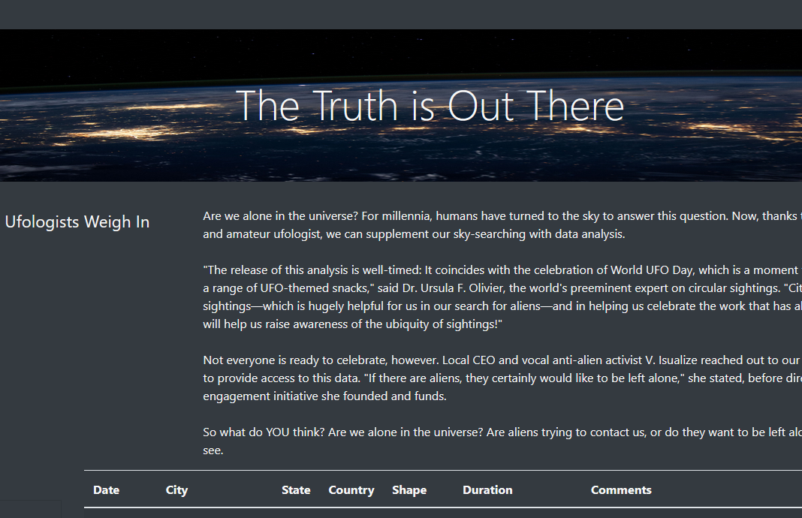
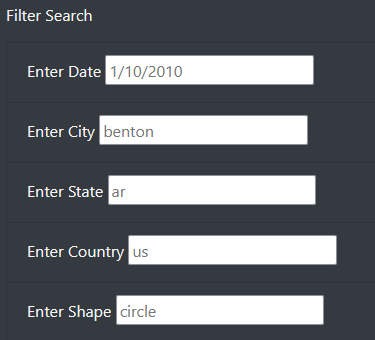

# UFOs
Link to [UFO database](https://sktwelve.github.io/UFOs/)

## Overview
The client has given us a database of ufo data and we have managed to make a webpage to house the data on a table. Now we have been tasked to update the filters for the table using d3 rather than a button to update the database.

## Results

All the data from the database is displayed on the table when the webpage is loaded. When a person loads up the page, they can choose to search by one of the search terms to filter the database for a specific slice of the table or they can use multiple filters to search for a specific event.

## Summary: In a summary statement, describe one drawback of this new design and two recommendations for further development.
All in all, the new design accomplishes what it set out to do. The new filter design works better for people that are looking for specific events that they are looking for. You can't filter by time periods or use multiple search terms in one field. One way to improve the filters is to allow for multiple search terms in each field. The other way it could be improved is through modifying the date field to accept time periods.
